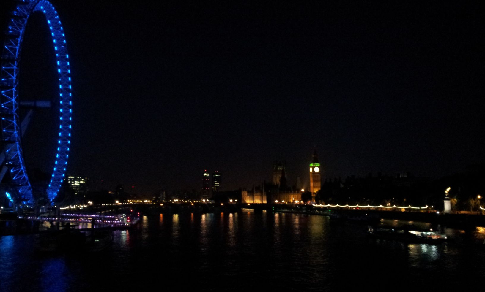

# DeepArt fun
Last weekend I finally took some of personal photos and artwork to ‘vangoghify’ i.e. “paint” them in, but not limited to, Van Gogh style. The “painting” part was actually an elegant extension from *Deep learning* research [1,2]. In short, the Deep learning model – a deep neural network – took your photo (referred as content-image) and a reference style (style-images) as the inputs and produce your photo in that style. I used a popular implementation, whose code is publicly provided [3]. 

As for hardware setup, my main work-horse is a humble nVidia GTX 660 2GB on a dated LGA 775 desktop. I also used NIN instead of VGG net due to limited VRAM. Each image was generated in ~90 seconds (max. 512px-wide) or 2-3 mins (max. 784px-wide). It’s highly recommended to run on a GPU instead of a CPU, since even the most modern i7 K-series can take upto hours to generate 1 image. 

## Observation
* Size matters. The higher the output image resolution, the more details in the content-image can be explicitly expressed by the indicated style. However, the **big** trade-off is memory. Default output image size (512px) on an NIN took as small as 5-600MB, but a 784px image devours 3 times as much. 
* For visual appeal, (i) an expressive style and/or (ii) resemblance between content-style image pair is the key. “Expressive” here is not only about abstract or surreal in specific, but about texture i.e. discernible patterns in colors, strokes, blobs in general. Example work: *Leonid Afremov’s painting, The Scream, Monet’s water lilies, …* Eventually, using style-images referenced from complicated realism pieces by the old masters, like Jean Leon Gerome, usually  yields unsatisfiying output with default parameters. Secondly, although it’s not always the case, but a landscape picture pairs pretty well with Starry Night or Wheat Field and the Crown; a portrait and Picasso’s self-portrait also makes a nice combination. 
* I lust over a Titan X.

## References
* A Neural Algorithm of Artistic Style https://github.com/jcjohnson/neural-style 
* Artomatix (NB: it should be known that this start-up has elevated a similar application on industrial-grade in 2014, one year before paper [1] was published)
* https://github.com/jcjohnson/neural-style

